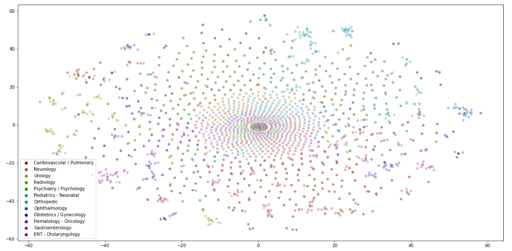

# `Text-Classification`
In this project, planned to develop a model that will make field estimation from 
medical texts by using natural language processing and data preprocessing methods. 
This model is a prediction model and machine learning methods and natural language 
processing methods will be used. The dataset in this project is a public dataset from kaggle.

## Tech and Libraries

- Pandas
- Numpy
- Sklearn
- Scispacy (NER)
- NLTK
- Seaborn
- SMOTE
- Logistic Regression

## Dataset

 - [Medical Transcriptions](https://www.mtsamples.com/)

## Screenshots

|  |
| :--:|
| *T-SNE Plot* |

|  |
| :--:|
| *Classification Scores* |

